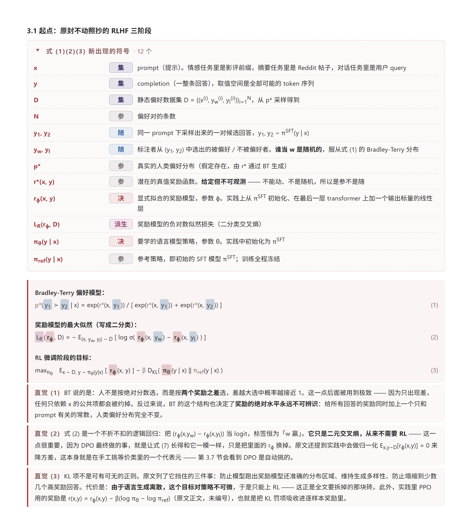

# read-paper

A [Claude Code](https://claude.com/claude-code) skill that turns a research paper (PDF) into a single self-contained HTML close-reading note.

Every symbol in every equation is color-coded by its role — decision variable, known parameter, random parameter, derived quantity, dual variable — glossed before it first appears, and followed by a plain-language note on what the equation *does*, not what it says. Equation numbers are copied from the source and verified against it. Inferences are kept separate from what the paper actually states, and tagged with a confidence level.

> ⚠️ **Output is in Chinese** (technical terms kept in English), as are the skill instructions themselves. English output is not currently supported.

```bash
git clone https://github.com/Jin-C137/read-paper.git ~/.claude/skills/read-paper
pip install pymupdf
```

---

**以下为中文正文。** 把一篇论文 PDF 读成一份自包含的 HTML 精读笔记——读者不看原文，也能弄清这篇在解决什么问题、模型长什么样、每条公式在说什么事、结论有多硬。

## 效果



<sub>截自 <a href="demo/dpo.html"><code>demo/dpo.html</code></a> 第 3.1 节。一屏里能看到这个 skill 的全部核心动作：<b>顶部释义表</b>把该组公式首次出现的符号逐个定义并标上身份徽章（这一屏里「集 / 参 / 随 / 决 / 派生」五型都出现了）；<b>中间公式块</b>里每个量的底色与徽章同色相，式号照抄原文、右对齐；<b>下方三段「直觉」</b>讲的是每条式子在说什么事、带来什么建模后果，不是复述公式。</sub>

一份真实产出，用 CC BY 4.0 的开放获取论文生成，未经手工修改：

| Demo | 论文 | 演示了什么 |
|---|---|---|
| [`demo/dpo.html`](demo/dpo.html) | Rafailov et al., *Direct Preference Optimization: Your Language Model is Secretly a Reward Model* ([arXiv:2305.18290](https://arxiv.org/abs/2305.18290)) | 配色 `crimson-blue`（非默认）。一条从 KL 约束的 RLHF 目标 → 闭式最优策略 → 反解奖励 → DPO loss 的完整推导链，22 个式号全部照抄原文 |

> **GitHub 不渲染仓库里的 HTML 文件**，直接点上面的链接只会看到源码。三种看法：
> 1. `git clone` 之后用浏览器打开本地文件（推荐，笔记是自包含单文件，离线可看）
> 2. 用 [htmlpreview.github.io](https://htmlpreview.github.io/) 粘贴文件的 raw 链接
> 3. 仓库开了 GitHub Pages 的话直接访问 Pages 地址


## 它解决什么问题

用 LLM 读论文，最常见的产出是一份「摘要的摘要」：句子都对，但读完还是不知道模型长什么样，公式一条都没看懂。这个 skill 换了一套约束：

- **公式里每个量都上底色**，按它在问题里的角色分成六型——集合 / 已知参数 / 决策变量（或待学参数）/ 不确定参数 / 派生中间量 / 对偶变量，其中五型在公式里各有一种底色。标完之后一眼能看出结构性问题：比如某条公式右边全是已知参数，说明它在算例里其实退化成了常数；又比如一个符号在两处底色不同，说明它在两个上下文里的身份变了，而这往往正是论文的关键动作所在。
- **符号释义在公式之前**，首次出现即定义，带单位和算例取值。不用读者在不认识符号的情况下先读一遍公式再回头对照。
- **每条实质性公式配一段「直觉」**——讲这式子在说什么事、带来什么建模后果，而不是把公式翻译成中文。
- **式号照抄原文，不重排**。笔记的价值有一半在于能拿着它回原文对照。交付前有脚本把用到的式号逐个拿回原文文本层核对。
- **严格区分「原文说的」和「我推断的」**，后者一律标置信度。这是这个 skill 的底线，比排版重要。
- **单文件、零外部资源**。CSS 内联，没有 ``、没有 CDN、没有字体外链，几十 KB，能直接发给别人、能存档、能离线看。

## 安装

**1. 拷进 Claude Code 的 skills 目录**

```bash
# macOS / Linux
git clone https://github.com/Jin-C137/read-paper.git ~/.claude/skills/read-paper

# Windows (PowerShell)
git clone https://github.com/Jin-C137/read-paper.git $env:USERPROFILE\.claude\skills\read-paper
```

预期：`~/.claude/skills/read-paper/SKILL.md` 存在。重启 Claude Code 后 `/read-paper` 出现在 skill 列表里。

**2. 装依赖**

```bash
pip install pymupdf
```

预期：`python -c "import fitz; print(fitz.__doc__)"` 能打印出版本号，不报 ImportError。
（PyMuPDF 的导入名是 `fitz`，不是 `pymupdf`——装错包是最常见的坑。）

## 用法

```
/read-paper <PDF 路径> [配色代号] [输出路径]
```

```
/read-paper ./papers/2401.12345.pdf
/read-paper ./papers/2401.12345.pdf crimson-blue ./notes/note.html
```

**配色**（每份输出只用一套，不做暗色模式）：

| 代号 | 名称 | 适合 |
|---|---|---|
| `deep-blue` | 深海蓝（默认） | 最正式，接近 Nature 正刊图注气质 |
| `teal-apricot` | 青绿杏 | 冷暖对比清楚，长时间读不累 |
| `rose-lilac` | 玫瑰霜 | 最柔和，适合内容密集的长稿 |
| `crimson-blue` | 朱蓝 | 对比最强，适合需要快速扫读 |

四套都过了 WCAG AA（每套 35 项对比度 ≥ 4.5:1）。

## 适用范围

**适用于任意论文类型。** SKILL.md 与 references/ 里的示例大多取自能源系统优化（这是作者的领域），但规则本身不绑定领域——六型徽章有一套明确的退化规则：

| 论文类型 | 「决」这一格实际是什么 |
|---|---|
| 优化 / 博弈 | 决策变量（六型全可用） |
| ML / 拟合 | 待学参数（权重、拟合系数） |
| 实证 / 统计 | 待估系数、检验统计量 |
| 物理 / 理论推导 | 被解出来的未知量（场、态、解） |
| 综述 | 通常无统一符号体系，可整个不用徽章 |

判据始终是三问：**优化器（或梯度下降）能动吗 → 是外部给的吗 → 外部给的话，确定还是随机**。这三问对任何类型的论文都成立；上表与判据打架时以判据为准。

**这条规则是真在跑判据，不是摆设。** 不同类型的论文跑下来，用到的徽章组合各不相同，很少有哪一篇用满六型：

| 论文类型 | 用到的徽章 | 没用哪型，为什么 |
|---|---|---|
| 偏好学习（见 [demo](demo/dpo.html)） | 集 · 参 · 决 · 随 · 派生 | 无「对」——KL 约束是以罚项直接写进目标的，全程没有引入拉格朗日乘子 |
| 深度学习架构 | 集 · 参 · 决 · 派生 | 无「对」（没有对偶形式）；无「随」（模型是确定映射，初始化的随机不算） |
| 运筹优化（MILP + Benders 分解） | 集 · 参 · 决 · 对 · 派生 | 无「随」（确定性模型，算例生成时的抽样不算） |

判据里最容易出错的一处：**造数据、初始化时的随机性不是「随」**。「随」指的是模型里真实存在的随机参数（比如 DPO 里服从 Bradley-Terry 分布的偏好标注），不是实验设置里的采样。

**默认四节**（motivation / literature review / 模型 / 算例与结果）也不是硬性的：原文没有对应内容（Letter 常无独立 literature review、纯理论文无算例）就写明「原文无此节」并交代替代内容，不硬凑。反过来，论文若有值得单独成节的东西（复杂求解方法、数据集的坑），就加一节。

## 已知限制

- **扫描件 PDF 读不了**。没有文本层，skill 会停下来告诉你，不会靠标题和摘要硬编内容。
- **PDF 文本层有损伤**是常态：减号、除号、上下划线、根号容易丢失或变形（`a−b` 抽成 `a  b`、`x/y` 抽成 `x=y`）。公式按上下文重建，交付说明里会写明这一点——**引用公式前请回原文核对**。
- **式号核对脚本抓不到「转写错误」**。它能抓出凭空造号（原文只到 (18)，笔记写了 (23)），但 (7) 误作 (8) 而原文正好有 (8) 这种，脚本查不出来。
- **文献综述表里「该文实际做了什么」是推断**，据标题与被引方的归类得出，整表标注「待核实」。把这些文献写进你自己稿子的 related work 之前，必须回源确认。
- **默认不放图**。笔记定位是纯文字，靠 HTML 盒子画的流程图和表格转述图里的信息。明确要求配图时可以放开（走 base64 内嵌），做法见 `references/rendering.md`。

## 定制

| 想改什么 | 改哪里 | 注意 |
|---|---|---|
| 配色 | `references/palettes.md` | 改完必须重跑对比度检查，判据在 `rendering.md` |
| 章节结构 | `references/content.md` | 结构本来就是可变的，改这里是预期用法 |
| 排版组件 | — | **不建议** |

**不要改 `assets/template.html` 里的 CSS。** 它和交付前的七条自检断言、35 项对比度判据是绑定的：改了字体会触发「禁用等宽字体」的断言（Cascadia/Consolas/Menlo 都不含汉字，中文会掉到宋体回退，与正文黑体撞字体类别）；改了色值不重跑对比度检查就可能跌破 AA。每条规则背后的理由都写在 `references/rendering.md` 里，改之前先读那里。

## 目录结构

```
read-paper/
├── SKILL.md                  # 入口：调用方式、五步执行流程、不可协商的七条
├── README.md
├── LICENSE
├── assets/
│   └── template.html         # 定稿的 CSS + 每个组件可照抄的 HTML 骨架
├── references/
│   ├── content.md            # 内容契约：每节写什么、什么时候加节/省节
│   ├── rendering.md          # 渲染规则 + 交付前自检脚本 + 对比度判据
│   └── palettes.md           # 四套配色 + 配色的五条硬约束
└── demo/                     # 真实产出示例，不参与 skill 运行
    ├── dpo.html
    └── screenshot.png
```

`SKILL.md` 是唯一常驻的入口，三份 `references/` 按需加载——这是 skill 的标准做法，避免把全部规则塞进每次对话的上下文。

## License

skill 本身（SKILL.md、references/、assets/）为 MIT，见 [LICENSE](LICENSE)。

`demo/` 下的笔记是对 **CC BY 4.0** 论文的二次创作，按 CC BY 4.0 署名要求，原论文出处与作者已写在笔记的页首与页脚。

**你自己生成的笔记内容归你所有，但要注意版权**：笔记会逐格复刻原文的公式、约束表和主结果表。**用付费数据库下载的、或非开放获取的论文生成的笔记，不要公开分发**——自己看没问题。挑 demo 论文时优先找 CC BY 的（arXiv 上不少论文用的是 arXiv 默认的 non-exclusive 授权，那个**不**足以支持再分发衍生内容）。
